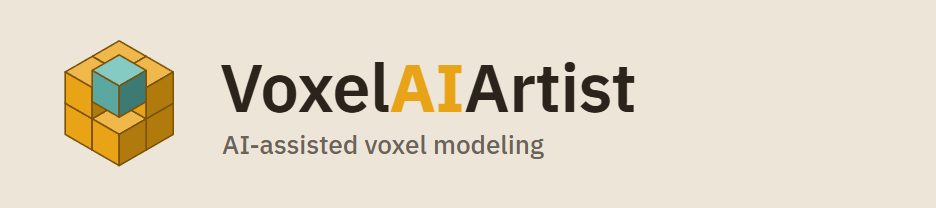
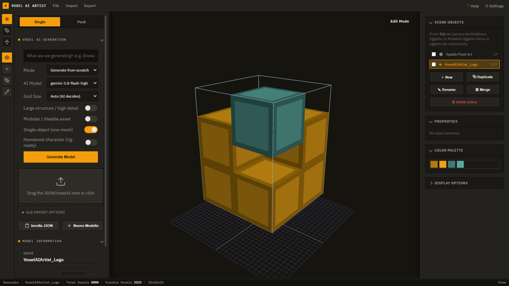

<p align="center">
  <picture>
    <source media="(prefers-color-scheme: dark)" srcset="assets/brand/lockup-dark.png">
    
  </picture>
</p>

<p align="center">
  <b>A voxel editor where the AI builds with you.</b><br>
  Describe a model, get it in voxels, then edit, texture, rig, animate and export it — or drive the whole thing from an AI agent over MCP.
</p>

<p align="center">
  
  
  
  
  
</p>

<p align="center">
  <a href="#quick-start">Quick start</a> ·
  <a href="#features">Features</a> ·
  <a href="#ai-providers">AI providers</a> ·
  <a href="#mcp-server">MCP server</a> ·
  <a href="#import--export">Import &amp; export</a> ·
  <a href="#sister-apps">Sister apps</a>
</p>

<p align="center">
  <br>
  <sub>The logo of this repo, built as a voxel model in the editor (<a href="assets/brand/logo-model.json">assets/brand/logo-model.json</a>).</sub>
</p>


## Quick start

Requirements: Windows, [Python 3.10](https://www.python.org/downloads/), a modern browser.

```bat
git clone https://github.com/Kekko16004/VoxelAIArtist.git
cd VoxelAIArtist
setup.bat          :: first run only: creates .venv and installs requirements
start_app.bat      :: starts the local server and opens the editor in your browser
```

On first launch the in-app **Settings** opens by itself if no AI provider is configured. Everything except generation works without one.

<details>
<summary>Other ways to run it</summary>

```bash
python main.py              # web mode (default): local server + system browser
python main.py --py         # desktop window (PyQt6 + QtWebEngine)
VOXELAI_MODE=web python main.py
```

Build a standalone executable with `build.bat` (PyInstaller, output in `dist/VoxelAIArtist.exe`).

</details>

## Features

| | |
|---|---|
| **Generate from a prompt** | Describe the model, pick a grid from 32³ to 512³ (or let the AI decide), and get a compact op-based model expanded into voxels. Modes for large structures, modular/tileable assets, multi-part objects and rig-ready humanoids. |
| **Modify with words** | "Make the roof red", "add a chimney": the AI edits the current model instead of starting over; incremental generation keeps what you already have. |
| **Pack mode** | Queue many generations in one consistent style — a style distiller keeps a whole asset set coherent. |
| **Edit like a 3D tool** | Add, paint and pick voxels, extrude faces (`E`), symmetry, primitives, multi-object outliner with Object/Edit modes (`Tab`), duplicate, merge, undo/redo. |
| **Materials & textures** | Per-project materials, a pixel-art material creator, AI-generated textures, and a full pixel editor one click away. |
| **Rig & animate** | Auto humanoid rig, rig tools and weights, a keyframe timeline, and AI-generated animation clips. Exports as a rigged GLB. |
| **Projects** | Save/open `.voxai` projects; light and dark themes; UI in English, Italian, German, French, Spanish and Portuguese. |


## AI providers

Gemini works with **zero configuration** through your browser session cookies (web client, not the official API). Next to it you can add your own providers in Settings:

| Provider | What you need |
|---|---|
| Gemini (built-in) | Google session cookies |
| Anthropic | API key + model |
| OpenAI-compatible | Base URL + key + model — OpenAI, OpenRouter, Groq, Together, LM Studio, Ollama, vLLM |
| Custom | Endpoint, auth header, request body and response path |

Providers and keys are shared across VoxelAIArtist and its sister apps, stored in `%APPDATA%\VoxelAIArtist\` and never in the repository. Keys are masked everywhere in the UI and API. No extra Python package is needed for any provider.

## MCP server

The whole editor is available to AI assistants (Claude, Kilo Code, Zcode, …) as **48 MCP tools**: create and edit voxels, generate with AI, create pixel-art textured blocks, rig, animate, import and export. It runs headless — no window needed — and produces the same `.voxai` files the app opens.

```bash
python -m mcp_server                                      # stdio
python -m mcp_server --sse --host 127.0.0.1 --port 8750   # HTTP: /mcp (streamable) + /sse
```

Or double-click `start_mcp_sse.bat`. Client configuration and the tool list: [mcp_server/README.md](mcp_server/README.md).

## Import & export

| | Formats |
|---|---|
| **Open / import** | `.voxai` project · `.json` / `.voxelai` model · `.vox` (MagicaVoxel) · `.schem` (Minecraft) · `.glb` (voxelized) |
| **Save / export** | `.voxai` project · `.json` · `.voxelai` (obfuscated) · `.obj` + `.mtl` · `.glb` (rigged, optional 1/100 autoscale for Unity/Blender) · `.vox` · `.schem` (WorldEdit/Litematica) |

Exports can drop internal cubes so only the visible shell is written. Ready-made models to try are in [examples/](examples).

## Sister apps

Two companion apps share the same local server model, AI providers and settings:

| App | What it does |
|---|---|
| [PixelAIEditor](PixelAIEditor) | 2D pixel-art and image editor with AI generation: layers, selections, background removal. Opens inside VoxelAIArtist's material creator to paint block faces. |
| [SimpleAIModeller](SimpleAIModeller) | Parametric 3D assets from a prompt: the AI writes a compact spec, a local engine builds it with primitives, CSG, bevels and deformers. |

## Development

```bash
bash tests/run_all.sh     # full suite — no network, no cookies, no AI quota (fake generator)
node ui/build.mjs         # rebuild ui/index.html from ui/src/
```

The UI is a single Three.js (r128) page built from `ui/src/`; the Python side (`main.py`, `src/`) serves it and talks to the AI providers. Voxel ops exist in both Python and JS and are kept identical by `tests/ops_parity_cases.json`. Architecture notes for contributors are in [CLAUDE.md](CLAUDE.md).

```text
main.py              local HTTP server, API routes, launch modes
src/                 AI providers, op expander, pack queue, settings
ui/                  editor UI (src/ modules → index.html), locales
mcp_server/          MCP server (48 tools)
PixelAIEditor/       sister app: pixel-art editor
SimpleAIModeller/    sister app: parametric modeller
examples/            sample models
assets/              prompts, brand
tests/               test suite
```

---

<p align="center"><sub>Made by KFDev.</sub></p>
